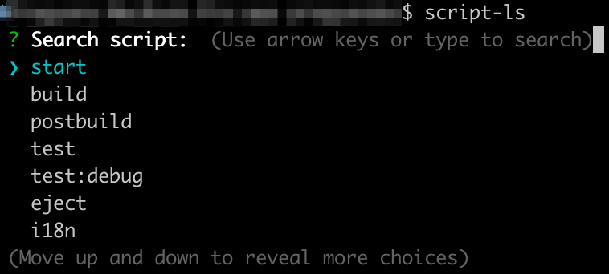
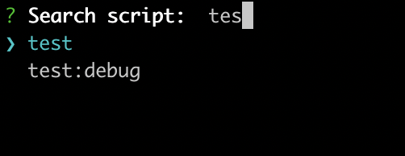

# What's script-ls ?

`script-ls` is a command-line tool to list-search-select-execute npm scripts defined in `package.json`. Usually, larger projects have a lot of scripts and it quickly becomes difficult to remember the more uncommon ones. `script-ls` makes it easy to search scripts (using keyword or a part of it), select a script from the list and execute the selected script.

# Usage

```
# install script-ls
npm install -global script-ls

# In your project root
script-ls
```

## List



## Search

`script-ls` has auto-complete with fuzzy search. Use ⬆⬇ to select and ⏎ to run.

